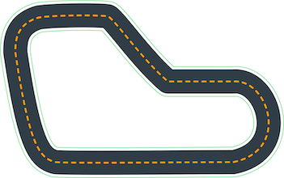

# TOR - DeepRacer AWS Summit Circuit Toronto 
### Oct 3,2019

[Summit Circuit](https://aws.amazon.com/deepracer/schedule-and-standings/?p=drl&exp=btn&loc=3)

**Deadline** 

## Training and Evaluation Track

## Current Standing

### Your rank: *n/a*
### Racer name: *Chris*
### Your best average lap time *n/a*
### Your best model *n/a*

## Strategies

- Conservative: centerline, small action space
- Moderate: large action space, varied speed-steer values
- Aggressive: race line, 

## Notes from physical racing comments

- 'Must master waypoints'
- small action space, due to simple corners on reinvent track
- winning times were ~9.5s, tokyo times were under 8s

## Notes from documentation

> When deploying the trained model to your AWS DeepRacer vehicle for driving on a real-world track, the maximum speed and steering angle of the vehicle must be calibrated to match those used in the simulation training

